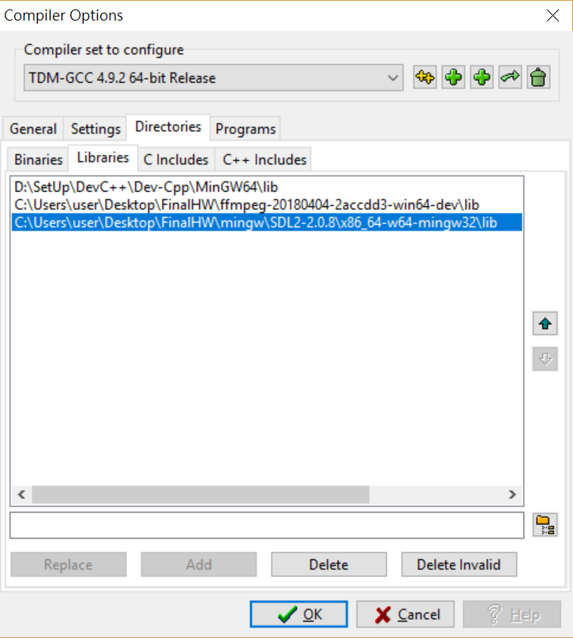
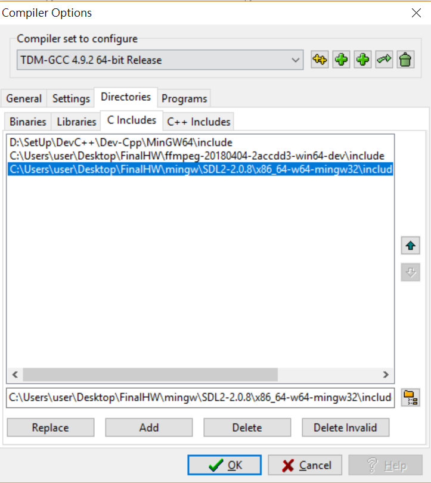
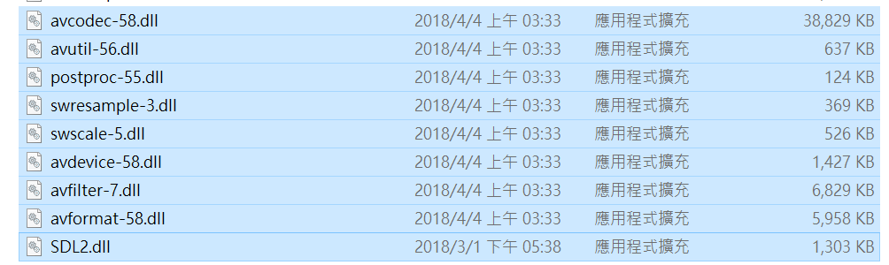
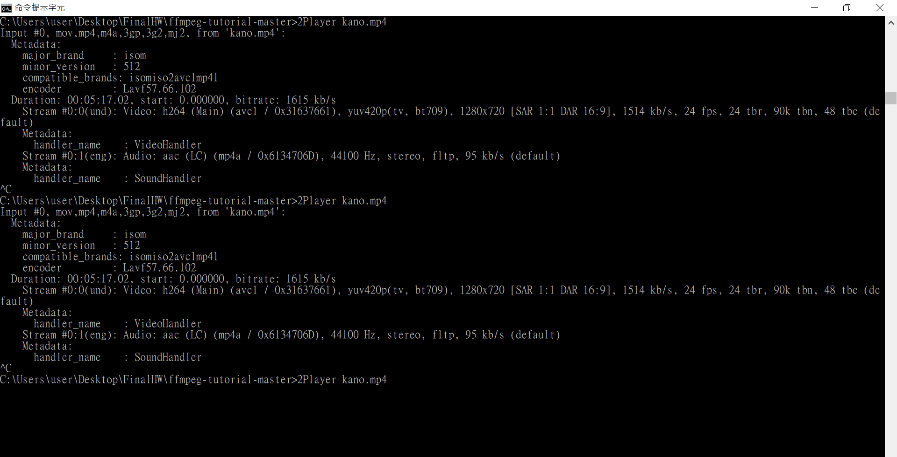
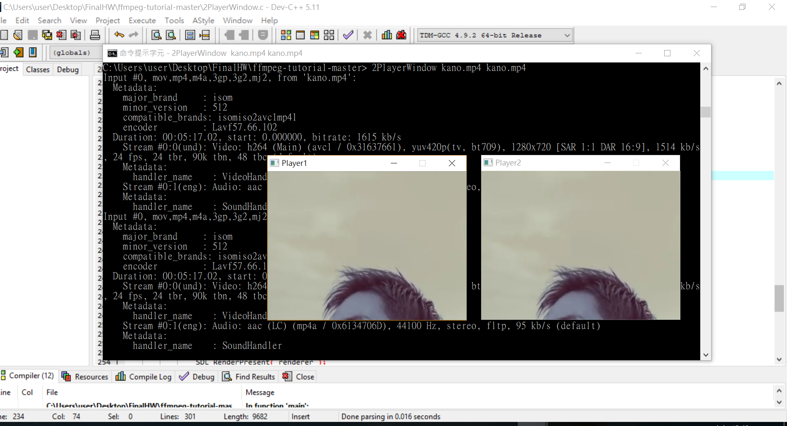

# FFmpeg-SDL2-2Screen-VideoPlayer

Step1: Setting the DevC++ compiler:  
Add: -libgcc -lpthread  -lavcodec.dll  -lavformat.dll  -lavutil.dll  -lswscale.dll -lmingw32 -lSDL2main -lSDL2
  
Step2: First prepare: ffmpeg-20180404  
Download the shared and dev
  
The dev version is for you to include and library in next step.  
The shared version is for you to take the “dll” file from bin file in next 2 step.  
Step3: Add the ffmpeg-20180404 into the Libraries and C Includes  
Download: https://ffmpeg.zeranoe.com/builds/  
Add the SDL 2 (mingw32) into the Libraries and C Includes  
Download: https://www.libsdl.org/download-1.2.php  
  
  
If you use official coding http://dranger.com/ffmpeg/tutorial01.html  
, you need to change the “PIX_FMT_RGB24”  to “AV_ PIX_FMT_RGB24”  
Step4: Make sure all “dll.file” in the same package with the “2PlayerWindow.c” for executing      
  
Step5: Compile and Run the “2PlayerWindow.c”  
Generate the “2PlayerWindow.exe” file  
Step6: Execute “2PlayerWindow YourVideoFileName.mp4 ”in cmd window  
Ex: 2PlayerWindow kano.mp4  
Ex: 2Thread YourVideoFileName1.mp4 YourVideoFileName2.mp4  
  
Step7:Result  
  
