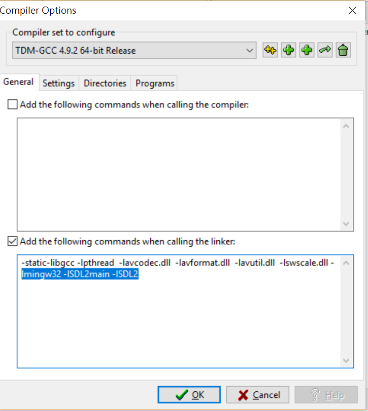

# FFmpeg-SDL2-2Screen-VideoPlayer

Step1: Setting the DevC++ compiler:  
Add: -libgcc -lpthread  -lavcodec.dll  -lavformat.dll  -lavutil.dll  -lswscale.dll -lmingw32 -lSDL2main -lSDL2
  
Step2: First prepare: ffmpeg-20180404  
Download the shared and dev
  
The dev version is for you to include and library in next step.  
The shared version is for you to take the “dll” file from bin file in next 2 step.  
Step3: Add the ffmpeg-20180404 into the Libraries and C Includes  
Download: https://ffmpeg.zeranoe.com/builds/  
Add the SDL 2 (mingw32) into the Libraries and C Includes  
Download: https://www.libsdl.org/download-1.2.php  
